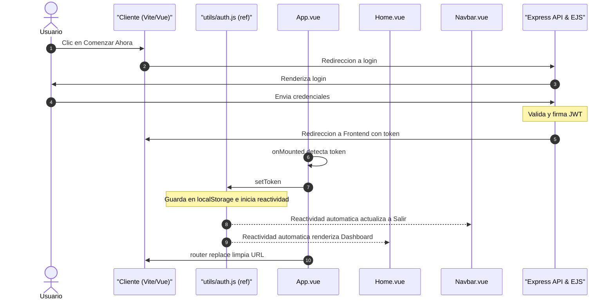
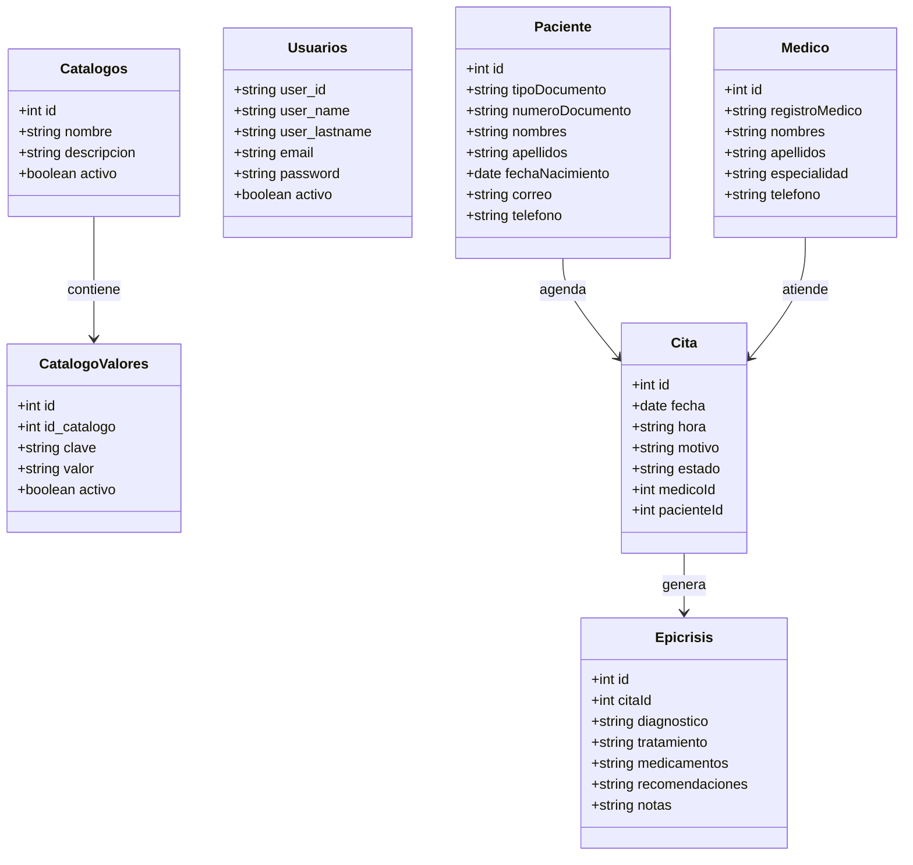
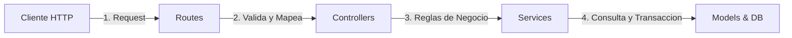
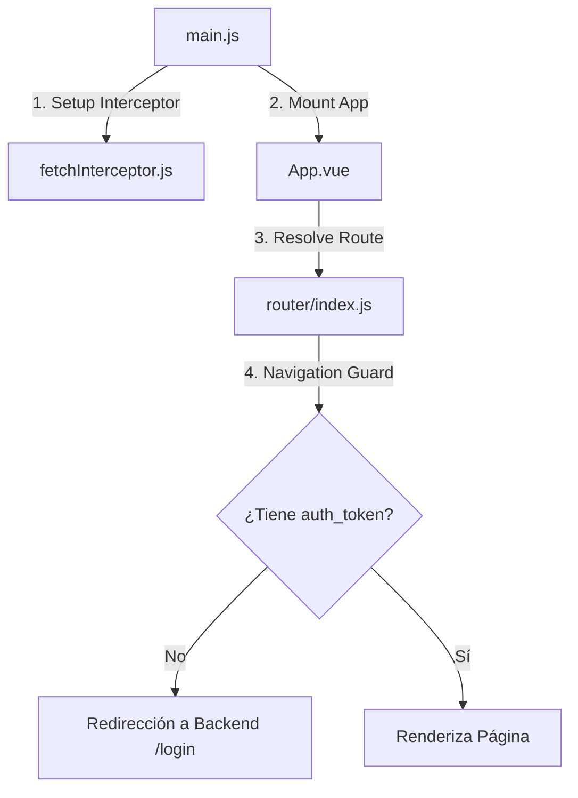

# MedicAPP - Plataforma de Gestión Médica Integral (Monorepo)

MedicAPP es una solución digital avanzada para la administración y control de clínicas y consultorios médicos. Permite gestionar de manera integrada el directorio de profesionales de la salud, el registro detallado de pacientes, la programación reactiva de citas médicas y la generación del historial clínico digital a través de epicrisis detalladas.

Este repositorio está estructurado como un **Monorepo** que utiliza **Yarn Workspaces** para coordinar y compartir dependencias entre las capas del servidor y el cliente.

---

## 🛠️ 1. Configuración del Proyecto y Guía de Inicio

### Requisitos Previos
Asegúrate de contar con Node.js (versión 20 o superior) y Yarn instalados en tu sistema.

### Instalación de Dependencias
Ejecuta el siguiente comando en la raíz del proyecto para descargar e instalar todas las dependencias tanto del frontend como del backend de forma simultánea:
```bash
yarn install
```

### Ejecución en Entorno de Desarrollo (Local)
Para levantar simultáneamente el servidor API backend (puerto 3000) y el servidor de desarrollo del cliente frontend (Vite en puerto 5173), ejecuta:
```bash
yarn dev:all
```
*   **Frontend (Cliente)**: Disponible en `http://localhost:5173/`
*   **Backend (Servidor & Swagger)**: Disponible en `http://localhost:3000/`

---

## 💻 2. Entorno de Desarrollo Recomendado

### Configuración de IDE Recomendada
*   **Editor**: [VS Code](https://code.visualstudio.com/)
*   **Extensión Oficial**: [Vue - Official (Volar)](https://marketplace.visualstudio.com/items?itemName=Vue.volar) (se sugiere desactivar la extensión antigua Vetur para evitar conflictos).
*   **Soporte de Diagramas**: Para visualizar los diagramas del README localmente en la vista previa de VS Code, se recomienda instalar la extensión **`Markdown Preview Mermaid Support`** de *Matt Bierner*.

### Configuración del Navegador Recomendada
Para depurar y visualizar de forma óptima los componentes y flujos reactivos de la aplicación:
*   **Navegadores basados en Chromium** (Chrome, Edge, Brave):
    *   Instala [Vue.js devtools](https://chromewebstore.google.com/detail/vuejs-devtools/nhdogjmejiglipccpnnnanhbledajbpd).
    *   Activa la opción **Custom Object Formatter** en la configuración de Chrome DevTools ([Guía](http://bit.ly/object-formatters)).
*   **Firefox**:
    *   Instala [Vue.js devtools para Firefox](https://addons.mozilla.org/en-US/firefox/addon/vue-js-devtools/).
    *   Activa la opción **Custom Object Formatter** en Firefox DevTools ([Guía](https://fxdx.dev/firefox-devtools-custom-object-formatters/)).

---

## 🏛️ 3. Arquitectura General y Estructura de Carpetas

La estructura completa del Monorepo está organizada de la siguiente manera:

```
MedicAPP/
├── package.json                   # Configuración de Workspaces y scripts raíz
├── docker-compose.yml             # Despliegue en contenedores de la app completa
├── README.md                      # Esta documentación maestra
├── src/
│   ├── backend/                   # SERVIDOR API REST (Express + Sequelize)
│   │   ├── package.json
│   │   ├── Dockerfile
│   │   ├── .env                   # Variables de entorno del servidor
│   │   └── src/
│   │       ├── server.js          # Punto de entrada de Express
│   │       ├── controllers/       # Controladores (Intercepción de HTTP)
│   │       ├── services/          # Servicios (Lógica de negocio pura)
│   │       ├── models/            # Capa de datos (Modelos Sequelize)
│   │       ├── database/          # Conexión SQLite y semillas de catálogo
│   │       ├── middleware/        # Middlewares de seguridad y auth
│   │       ├── routes/            # Definición y documentación OpenAPI de endpoints
│   │       └── views/             # Plantillas EJS (Login server-side)
│   │
│   └── frontend/                  # CLIENTE SPA (Vite + Vue 3)
│       ├── package.json
│       ├── vite.config.js         # Configuración de compilación y Vue DevTools
│       ├── index.html             # HTML base
│       └── src/
│           ├── main.js            # Inicialización de la aplicación Vue
│           ├── App.vue            # Componente raíz
│           ├── config.js          # Constantes del backend
│           ├── router/            # Rutas de la SPA y guards de navegación
│           ├── middleware/        # Interceptores globales de fetch
│           ├── utils/             # Estados reactivos compartidos (Auth)
│           ├── components/        # Componentes reutilizables (UI)
│           └── pages/             # Vistas principales de la aplicación
```

---

## 🔑 4. Arquitectura del Flujo de Autenticación Reactiva

El flujo de autenticación de MedicAPP es de tipo híbrido. Utiliza una **vista server-side de inicio de sesión** (renderizada en EJS) por motivos de seguridad y velocidad, pero se integra en tiempo real con una **arquitectura de Estado Reactivo Compartido** en la SPA mediante la Composition API de Vue 3.



---

## 🛠️ 5. Análisis Línea por Línea de los Componentes Clave de Autenticación

A continuación, se detalla el comportamiento lógico de cada sentencia de código que hace posible este flujo reactivo en tiempo real.

### 📝 Archivo A: Estado Reactivo Global ([auth.js](./src/frontend/src/utils/auth.js))
Encapsula la reactividad de la sesión, actuando como la fuente de verdad única para el cliente.
```javascript
import { ref } from 'vue';

/**
 * @constant {Ref<boolean>} isAuthenticated
 * Define si el usuario se encuentra autenticado.
 * Inicializa leyendo de manera sincrónica el localStorage al cargar la app.
 */
export const isAuthenticated = ref(!!localStorage.getItem('auth_token'));

/**
 * Almacena el token recibido y activa la reactividad global.
 * @param {string} token - Token JWT generado por el Backend.
 */
export function setToken(token) {
  // 1. Guarda físicamente el token para persistencia ante recargas de página.
  localStorage.setItem('auth_token', token);
  
  // 2. Modifica el ref reactivo. Al cambiar su valor, Vue notifica automáticamente
  //    a todos los componentes importadores para que actualicen su DOM.
  isAuthenticated.value = true;
}

/**
 * Limpia las credenciales y desactiva la reactividad global del login.
 */
export function clearToken() {
  // 1. Destruye el token persistido.
  localStorage.removeItem('auth_token');
  
  // 2. Apaga el indicador reactivo, ocultando el Dashboard y mostrando la Landing Page.
  isAuthenticated.value = false;
}
```

### 📝 Archivo B: Componente Raíz ([App.vue](./src/frontend/src/App.vue))
Inicializa la aplicación y captura el token devuelto por la redirección de login del backend.
```vue
<script setup>
import { onMounted } from 'vue'
import { useRouter, useRoute } from 'vue-router'
import Navbar from './components/Navbar.vue'
import { setToken } from './utils/auth.js' // Importación de la utilidad centralizada

const router = useRouter()
const route = useRoute()

onMounted(() => {
  // 1. Lee los parámetros de búsqueda en la barra de direcciones de la pestaña actual.
  const urlParams = new URLSearchParams(window.location.search)
  const token = urlParams.get('token')

  // 2. Si hay un token inyectado por el backend en la redirección de login:
  if (token) {
    // 3. Lo registra en el estado reactivo compartido, propagando reactividad al instante.
    setToken(token)
    
    // 4. Limpia los parámetros de la URL para que no queden expuestos estéticamente.
    router.replace({ path: '/' })
  }
})
</script>

<template>
  <Navbar />
  <div class="main-content">
    <router-view />
  </div>
</template>

<style scoped>
.main-content {
  padding-top: 80px;
  min-height: 100vh;
  background-color: #f8f9fa;
}
</style>
```

### 📝 Archivo C: Barra de Navegación ([Navbar.vue](./src/frontend/src/components/Navbar.vue))
El menú cambia dinámicamente sus botones ("Ingresar" o "Salir") consumiendo directamente el estado sin usar escuchadores manuales de eventos.
```vue
<script setup>
import { useRouter } from 'vue-router';
import { LOGIN_URL } from '../config.js';
import { isAuthenticated, clearToken } from '../utils/auth.js'; // Importamos el estado global

const router = useRouter();

/**
 * Redirige al flujo de login del Backend (renderizado en servidor).
 */
const login = () => {
  window.location.href = LOGIN_URL;
};

/**
 * Ejecuta el flujo de salida limpiando reactivamente el token.
 */
const logout = () => {
  clearToken(); // Actualiza el estado reactivo global inmediatamente
  
  // Si el usuario se encuentra en una ruta protegida (ej: administración),
  // lo redirige al home público.
  if (router.currentRoute.value.path !== '/') {
    router.push('/');
  }
};

const goHome = () => {
  router.push('/');
};
</script>

<template>
  <nav class="navbar navbar-expand-lg medicapp-navbar fixed-top shadow-sm">
    <div class="container-fluid align-items-center justify-content-between">
      <div class="d-flex align-items-center text-decoration-none navbar-brand-container" style="cursor: pointer;" @click="goHome">
        
        <span class="app-name ms-2">MedicAPP</span>
      </div>

      <div class="d-flex align-items-center">
        <!-- v-if evalúa de forma puramente reactiva el estado isAuthenticated -->
        <button v-if="!isAuthenticated" @click="login" class="btn btn-primary rounded-pill px-4 d-flex align-items-center gap-2 login-btn">
          <i class="bi bi-box-arrow-in-right"></i> Ingresar
        </button>
        <button v-else @click="logout" class="btn btn-outline-danger rounded-pill px-4 d-flex align-items-center gap-2 logout-btn">
          <i class="bi bi-box-arrow-right"></i> Salir
        </button>
      </div>
    </div>
  </nav>
</template>
```

---

## 💾 6. Capa de Base de Datos y Modelos (Backend)

La persistencia de datos se gestiona de forma local y autónoma mediante **SQLite** y el mapeo objeto-relacional de **Sequelize**.



### 🔌 Conexión de Sequelize: [connection.js](./src/backend/src/database/connection.js)
Inicializa Sequelize conectando al motor ligero SQLite y mapeándolo a un archivo físico.
```javascript
import { Sequelize } from 'sequelize'
import path from 'path'
import { fileURLToPath } from 'url'

const __filename = fileURLToPath(import.meta.url)
const __dirname = path.dirname(__filename)

const sequelize = new Sequelize({
  dialect: 'sqlite',
  storage: path.join(__dirname, 'medicapp.sqlite'), // Base de datos en archivo plano
  logging: false // Evita inundar la terminal con logs de SQL plano
})

export default sequelize
```

### 🧬 Estructura Detallada de Modelos (`src/backend/src/models/`)

1.  **`Usuarios.js`**: Representa a los usuarios del sistema. Utiliza hooks de ciclo de vida (`beforeCreate`, `beforeUpdate`) con **bcrypt** para realizar el hashing asíncrono de las contraseñas antes de guardarse en base de datos.
2.  **`Paciente.js`**: Mapea la información personal de los pacientes. Cuenta con validaciones nativas de Sequelize como `isEmail: true` para el correo electrónico y restricciones de unicidad (`unique: true`) sobre el campo `numeroDocumento`.
3.  **`Medico.js`**: Registra al personal facultativo con campos estrictos como `registroMedico` (único) y `especialidad` (que mapea hacia una clave del catálogo de especialidades).
4.  **`Cita.js`**: Entidad intermedia que representa un agendamiento médico. Contiene las claves foráneas de relación (`medicoId`, `pacienteId`), la fecha (`DATEONLY`), hora y el estado de la cita, el cual por defecto es `'Pendiente'`.
5.  **`Epicrisis.js`**: Registro clínico correspondiente a una cita médica completada. Contiene campos de texto libre para el `diagnostico`, `tratamiento`, `medicamentos`, `recomendaciones` y `notas` médicas.
6.  **`Catalogos.js`** y **`CatalogoValores.js`**: Entidades parametrizables que permiten cargar valores dinámicos para combos desplegables (como tipos de documento o especialidades), evitando la codificación en duro en base de datos.

### 🚀 Inicialización y Semillas: [seed.js](./src/backend/src/database/seed.js)
Se ejecuta de forma automática en cada arranque seguro del servidor (`sequelize.sync({ force: false })`), insertando los catálogos básicos si estos no existen y creando un administrador maestro por defecto:

*   **Tipos de Documento**: `CC` (Cédula), `TI` (Tarjeta Identidad), `CE` (Cédula Extranjería), `PA` (Pasaporte), `PT` (Permiso Temporal).
*   **Estados de Cita**: `Pendiente`, `Completada`, `Cancelada`.
*   **Especialidades Médicas**: Cardiología, Pediatría, Ginecología, Dermatología, Oftalmología, Ortopedia.
*   **Usuario Administrador**:
    *   **User ID**: `admin`
    *   **Email**: `admin@medicapp.com`
    *   **Password**: `admin` (encriptado automáticamente por el hook en base de datos).

---

## 🛣️ 7. Capa de Rutas, Controladores y Servicios (Backend)

La API del backend adopta una **arquitectura en tres capas** (Routes ➔ Controllers ➔ Services ➔ Models) para separar claramente la recepción de tráfico HTTP, la lógica de validación de orquestación, y el acceso transaccional.



### 🛡️ Middleware de Seguridad: [authMiddleware.js](./src/backend/src/middleware/authMiddleware.js)
Es el guardián de todas las rutas de la API. Extrae el token `Authorization: Bearer <token>`, valida su integridad y vigencia con la clave `JWT_SECRET` y decodifica la información del usuario inyectándola en el objeto `req.user`.

```javascript
import jwt from 'jsonwebtoken';

export const verifyToken = (req, res, next) => {
    const authHeader = req.headers['authorization'];
    if (!authHeader) {
        return res.status(403).json({ error: 'Un token es requerido para la autenticación' });
    }

    const token = authHeader.split(' ')[1]; // Extrae el token omitiendo el prefijo "Bearer "
    if (!token) {
        return res.status(403).json({ error: 'Token inválido o no proporcionado' });
    }

    try {
        const decoded = jwt.verify(token, process.env.JWT_SECRET);
        req.user = decoded; // Adjunta la sesión decodificada a la petición
        return next(); // Cede el flujo al controlador
    } catch (err) {
        return res.status(401).json({ error: 'Token expirado o inválido' });
    }
};
```

### 📂 Análisis de Controladores y Servicios

#### A. Controladores (`src/backend/src/controllers/`)
Actúan como fachada. Capturan errores en bloques `try/catch` y devuelven respuestas HTTP estructuradas en JSON.
*   **`pacientesController.js`**: Orquesta el registro, actualización, listado y eliminación de pacientes consumiendo `pacientesService.js`.
*   **`medicosController.js`**: Permite realizar operaciones CRUD de personal médico.
*   **`citasController.js`**: Orquesta el agendamiento y la visualización de agendas.
*   **`epicrisisController.js`**: Permite registrar el historial de atención de una cita médica.
*   **`catalogosController.js`**: Administra la parametrización de catálogos y la adición o edición de sus valores.
*   **`usuariosController.js`**: Contiene la lógica del login.
    *   `login(req, res)`: Renderiza el formulario web server-side `views/login.ejs`.
    *   `authenticate(req, res)`: Valida las credenciales mediante el servicio de usuarios y redirige al frontend pasando el JWT en la URL:
        `return res.redirect(`${process.env.FRONTEND_URL}/?token=${token}`);`

#### B. Servicios (`src/backend/src/services/`)
Aquí reside la lógica pura de la aplicación.
*   **`usuariosService.js`**:
    *   `authenticate(email, password)`: Busca al usuario por su email. Si existe, valida su contraseña asíncronamente con `bcrypt.compare`. Si es correcta, firma un JWT usando `jsonwebtoken` conteniendo el `user_id`, `email` y `rolId` con expiración.
*   **`citasService.js`**:
    *   `list(query)`: Permite filtrar citas por fecha específica (para el dashboard de citas de hoy) y soporta paginación automática (`page`, `limit`) mediante consultas `findAndCountAll` de Sequelize, incluyendo relaciones completas con `Medico`, `Paciente` y `Epicrisis`.

---

## 🔒 8. Arranque de Servidor y Endpoints API (Backend)

El archivo central del backend es [server.js](./src/backend/src/server.js). Sus procesos y configuraciones clave son:

1.  **Seguridad de Cabeceras (Helmet)**:
    Configura políticas estrictas de seguridad de contenido (CSP) permitiendo fuentes confiables como Google Fonts e inline styles controlados para mitigar ataques XSS.
2.  **Límite de peticiones (Rate Limit)**:
    Establece que una misma IP puede realizar un máximo de 100 peticiones en una ventana de 15 minutos sobre los endpoints de la API y el Login.
3.  **Documentación OpenAPI (Swagger)**:
    Genera especificaciones OpenAPI en `/` para documentar interactivamente las operaciones de la API REST (Pacientes, Medicos, Citas, Epicrisis, Catalogos).
4.  **Sincronización y Escucha**:
    Sincroniza la base de datos, ejecuta las semillas e inicia el servidor en el puerto 3000.

---

## 🖥️ 9. Capa de Cliente e Interfaz de Usuario (Frontend)

El frontend está desarrollado sobre la arquitectura modular de **Vue 3 (Composition API)** con la velocidad de empaquetado de **Vite**.



### 🛰️ Interceptor de Fetch Global: [fetchInterceptor.js](./src/frontend/src/middleware/fetchInterceptor.js)
Intercepta todas las llamadas HTTP de la aplicación en el cliente. Inyecta el encabezado `Authorization: Bearer <token>` a cada consulta de API de forma transparente para los desarrolladores. Si detecta códigos `401` (Unauthorized) o `403` (Forbidden) debido a tokens expirados o alterados, destruye la sesión y fuerza el re-login.

```javascript
import { API_BASE_URL } from '../config.js'

export function setupFetchInterceptor() {
  const originalFetch = window.fetch;
  
  window.fetch = async (url, options = {}) => {
    const token = localStorage.getItem('auth_token');
    
    if (token && typeof url === 'string' && url.includes(API_BASE_URL)) {
      options.headers = {
        ...options.headers,
        'Authorization': `Bearer ${token}`
      };
    }
    
    const response = await originalFetch(url, options);
    
    if (response.status === 401 || response.status === 403) {
      localStorage.removeItem('auth_token');
      window.location.href = "/";
    }
    
    return response;
  };
}
```

### 🧭 Rutas y Guardianes: [index.js](./src/frontend/src/router/index.js)
Define las URL navegables de la SPA. Implementa un guardián global `router.beforeEach` que intercepta cada navegación:
*   Si la ruta es `/` (Home), permite la visualización libre de la Landing Page o del Dashboard dependiendo del estado de la sesión.
*   Para cualquier otra ruta de la aplicación (Registrar pacientes, médicos, agendar citas, administración), exige obligatoriamente un token de autenticación. Si el token está ausente, redirige al usuario a la página de login del backend.

---

## 📦 10. Modularización y Desacoplamiento de la Vista Principal

Para evitar un archivo masivo y difícil de leer en el Home, la página principal [Home.vue](./src/frontend/src/pages/Home.vue) se ha transformado en un orquestador que cambia dinámicamente de vista:

```vue
<script setup>
import { isAuthenticated } from "../utils/auth.js"; // Única importación requerida para control de flujos
import Dashboard from "../components/Dashboard.vue";
import LandingPage from "../components/LandingPage.vue";
</script>

<template>
  <div>
    <!-- Renderizado declarativo condicional -->
    <Dashboard v-if="isAuthenticated" />
    <LandingPage v-else />
  </div>
</template>
```

### 📊 Componente A: Panel de Gestión Clínica ([Dashboard.vue](./src/frontend/src/components/Dashboard.vue))
Este componente encapsula toda la funcionalidad interna del panel clínico que ve el personal médico una vez ha ingresado al sistema.

```vue
<script setup>
import { ref, computed, onMounted } from "vue";
import { useRouter } from "vue-router";
import ActionCard from "./ActionCard.vue";
import AppointmentCard from "./AppointmentCard.vue";
import dayjs from "dayjs";
import { API_BASE_URL } from '../config.js';

const router = useRouter();
const citas = ref([]);
const especialidades = ref([]);
const todayStr = dayjs().format('YYYY-MM-DD'); // Obtiene la fecha actual en formato AAAA-MM-DD

/**
 * Consulta la base de datos de citas del día actual y catálogos de especialidades.
 */
const loadData = async () => {
  try {
    const [citasRes, catalogosRes] = await Promise.all([
      fetch(`${API_BASE_URL}/citas?fecha=${todayStr}`),
      fetch(`${API_BASE_URL}/catalogos`)
    ]);

    if (citasRes.ok) {
      citas.value = await citasRes.json();
    }
    
    if (catalogosRes.ok) {
      const catalogos = await catalogosRes.json();
      // Obtiene el catálogo de especialidades para asociar los códigos con nombres amigables
      const catDocs = catalogos.find(c => c.nombre.toUpperCase() === 'ESPECIALIDADES MÉDICOS' || c.nombre.toUpperCase() === 'ESPECIALIDADES MÉDICAS');
      if (catDocs && catDocs.valores) {
        especialidades.value = catDocs.valores;
      }
    }
  } catch (err) {
    console.error("Error cargando citas", err);
  }
};

/**
 * Propiedad Computada: Ordena las citas del día ascendentemente según la hora de agendamiento.
 * Se actualiza automáticamente si cambia el listado de citas devuelto por el Backend.
 */
const citasHoy = computed(() => {
  return [...citas.value].sort((a, b) => a.hora.localeCompare(b.hora));
});

// Al montarse el componente en el DOM, gatilla la lectura de datos
onMounted(() => {
  loadData();
});
</script>

<template>
  <div class="container mt-5">
    <h1 class="text-center mb-4">Bienvenido a MedicAPP</h1>
    
    <!-- 4 Accesos Rápidos Principales -->
    <div class="row">
      <div class="col-md-3 mb-4">
        <ActionCard
          title="Registrar Paciente"
          description="Registra un nuevo paciente en el sistema."
          icon="bi bi-person-plus-fill"
          iconColor="#007bff"
          buttonText="Registrar"
          buttonClass="btn-primary"
          @action="router.push('/registrar-paciente')"
        />
      </div>
      <div class="col-md-3 mb-4">
        <ActionCard
          title="Registrar Medico"
          description="Registra un nuevo médico en la plataforma."
          icon="bi bi-heart-pulse"
          iconColor="#28a745"
          buttonText="Registrar"
          buttonClass="btn-success"
          @action="router.push('/registrar-medico')"
        />
      </div>
      <div class="col-md-3 mb-4">
        <ActionCard
          title="Agendar Cita"
          description="Programa una cita médica con facilidad."
          icon="bi bi-calendar-event"
          iconColor="#ffc107"
          buttonText="Agendar"
          buttonClass="btn-warning"
          @action="router.push('/agendar-cita')"
        />
      </div>
      <div class="col-md-3 mb-4">
        <ActionCard
          title="Administración"
          description="Gestiona los catálogos y configuraciones del sistema."
          icon="bi bi-gear-fill"
          iconColor="#17a2b8"
          buttonText="Administrar"
          buttonClass="btn-info text-white"
          @action="router.push('/administracion')"
        />
      </div>
    </div>

    <!-- Sección de Citas Clínicas -->
    <div class="mt-5">
      <h2 class="text-center mb-4">Citas Programadas para Hoy</h2>
      <div v-if="citasHoy.length > 0" class="row">
        <!-- Renderiza iterativamente cada AppointmentCard -->
        <div v-for="cita in citasHoy" :key="cita.id" class="col-md-6 col-sm-12 mb-3">
          <AppointmentCard
            :appointment="cita"
            :especialidades="especialidades"
            @click="router.push(`/registrar-epicrisis/${cita.id}`)"
          />
        </div>
      </div>
      <!-- En caso de no existir citas programadas -->
      <div v-else class="text-center">
        <p>No hay citas programadas para hoy.</p>
      </div>
    </div>
  </div>
</template>
```

### 🖼️ Componente B: Portal de Presentación Pública ([LandingPage.vue](./src/frontend/src/components/LandingPage.vue))
Aísla la presentación institucional y comercial de la plataforma médica.
```vue
<script setup>
import ServiceCard from "./ServiceCard.vue";
import ContactFab from "./ContactFab.vue";
import { LOGIN_URL } from '../config.js';

/**
 * Fuerza el inicio de redirección hacia el servidor de autenticación del Backend.
 */
const goToLogin = () => {
  window.location.href = LOGIN_URL;
};
</script>

<template>
  <div class="landing-page container">
    <!-- Héroe / Presentación principal -->
    <div class="row align-items-center" style="min-height: 40vh;">
      <div class="col-md-6 text-center mb-4 mb-md-0">
        
      </div>
      <div class="col-md-6 text-center text-md-start">
        <h1 class="display-5 fw-bolder mb-3" style="background: linear-gradient(135deg, #2c3e50, #3498db); -webkit-background-clip: text; -webkit-text-fill-color: transparent; letter-spacing: -1px;">
          Tu asistente<br>médico digital
        </h1>
        <p class="lead mb-3 text-muted" style="font-size: 1.1rem;">
          Gestiona pacientes, médicos, agendas y registros clínicos desde una plataforma única, moderna y eficiente.
        </p>
        <button @click="goToLogin" class="btn btn-primary rounded-pill px-4 py-2 shadow-sm" style="background: linear-gradient(135deg, #007bff, #0056b3); border: none; font-weight: 600; transition: transform 0.2s ease;">
          Comenzar Ahora <i class="bi bi-arrow-right ms-2"></i>
        </button>
      </div>
    </div>

    <!-- Sección de Portafolio / Servicios Clínicos -->
    <div class="py-5 mt-2 mb-5">
      <div class="text-center mb-5">
        <h2 class="fw-bold" style="color: #2c3e50;">Todo lo que necesitas en un solo lugar</h2>
        <p class="text-muted" style="font-size: 1.1rem;">Descubre las herramientas diseñadas para optimizar la gestión de tu consultorio.</p>
      </div>
      
      <div class="row g-4">
        <!-- Servicio 1: Pacientes -->
        <div class="col-md-3">
          <ServiceCard 
            title="Gestión de Pacientes"
            description="Mantén un registro detallado y organizado de todos tus pacientes de manera segura e instantánea."
            icon="bi-people-fill"
            iconColor="#007bff"
            iconBg="rgba(0, 123, 255, 0.1)"
          />
        </div>
        
        <!-- Servicio 2: Directorio Médico -->
        <div class="col-md-3">
          <ServiceCard 
            title="Directorio Médico"
            description="Administra el personal médico, especialidades y horarios de atención con total facilidad."
            icon="bi-heart-pulse-fill"
            iconColor="#28a745"
            iconBg="rgba(40, 167, 69, 0.1)"
          />
        </div>

        <!-- Servicio 3: Calendario -->
        <div class="col-md-3">
          <ServiceCard 
            title="Agendamiento"
            description="Programa, modifica y controla citas médicas con un calendario rápido e intuitivo."
            icon="bi-calendar-event-fill"
            iconColor="#ffc107"
            iconBg="rgba(255, 193, 7, 0.1)"
          />
        </div>

        <!-- Servicio 4: Epicrisis -->
        <div class="col-md-3">
          <ServiceCard 
            title="Epicrisis y Reportes"
            description="Genera y consulta historiales clínicos y reportes de atención en tiempo real."
            icon="bi-file-earmark-medical-fill"
            iconColor="#17a2b8"
            iconBg="rgba(23, 162, 184, 0.1)"
          />
        </div>
      </div>
    </div>

    <!-- Botón Flotante de Contacto Rápido -->
    <ContactFab email="contacto@medicapp.com" />
  </div>
</template>
```

---

## 📧 11. Configuración de Correo SMTP con Mailtrap

Para que el envío de correos de recuperación de contraseña funcione correctamente en entorno local, el sistema utiliza **Mailtrap**, un servidor SMTP de desarrollo gratuito que simula el envío de emails reales a una bandeja de entrada segura e interactiva sin molestar a usuarios de verdad.

Sigue estos pasos paso a paso para configurar tus credenciales SMTP de forma segura:

### 📥 Paso 1: Crear una Cuenta Gratuita en Mailtrap
1.  Ingresa a la página oficial de [Mailtrap.io](https://mailtrap.io/).
2.  Haz clic en **Sign Up** y crea una cuenta gratuita utilizando tu correo de preferencia o a través de tu cuenta de GitHub/Google.

### 🔑 Paso 2: Obtener las Credenciales SMTP de tu Sandbox
1.  Una vez iniciada tu sesión en Mailtrap, navega en el panel izquierdo a **Email Testing** y haz clic en **Inboxes**.
2.  Verás tu bandeja de entrada virtual de pruebas (por defecto se llama **My Inbox**). Haz clic sobre ella para abrirla.
3.  En la parte superior de la bandeja de entrada, selecciona la pestaña **Show Credentials**.
4.  Verás los parámetros SMTP de tu servidor de pruebas:
    *   **Host**: `sandbox.smtp.mailtrap.io`
    *   **Port**: `2525` (o `587` / `465`)
    *   **Username** (Un código alfanumérico largo único para tu cuenta).
    *   **Password** (Otro código alfanumérico largo único para tu cuenta).
5.  *Tip*: Si seleccionas en el menú desplegable **"Integrations"** la opción **Nodemailer**, el panel te mostrará la configuración lista en formato Javascript para copiar y pegar.

### 📝 Paso 3: Configurar las Variables de Entorno en MedicAPP
1.  Abre el archivo de configuración de entorno del backend localizado en `./src/backend/.env`.
2.  Ubica la sección de configuración SMTP y **reemplaza las credenciales por las tuyas** obtenidas en el paso anterior (no utilices credenciales ajenas):
    ```env
    # Configuración SMTP de Mailtrap para Recuperación de Contraseña
    SMTP_HOST=sandbox.smtp.mailtrap.io
    SMTP_PORT=2525
    SMTP_USER=COPIA_AQUI_TU_USERNAME_DE_MAILTRAP
    SMTP_PASS=COPIA_AQUI_TU_PASSWORD_DE_MAILTRAP
    ```

> [!WARNING]
> **Seguridad de Credenciales**: Nunca compartas ni subas tu archivo `.env` a repositorios públicos como GitHub/GitLab para evitar filtraciones de credenciales. Este archivo ya se encuentra registrado en el archivo `.gitignore` del backend.

---

## 🧪 12. Plan de Verificación y Testing Manual

Para comprobar la robustez y correcto funcionamiento de todo el flujo, realiza los siguientes pasos secuenciales:

1.  **Comprobación del Login**:
    *   Ingresa a `http://localhost:5173/`. Deberás ver la **Landing Page** inicial.
    *   Haz clic en **Comenzar Ahora**. Serás redirigido automáticamente a la URL del backend `http://localhost:3000/login`.
    *   Introduce las credenciales maestras: `admin@medicapp.com` y la contraseña `admin`.
    *   Al enviar el formulario, el backend te redireccionará de vuelta al frontend inyectando el token JWT. Deberás ver instantáneamente el **Dashboard** reactivo con las citas programadas de hoy, y la barra de navegación superior mostrará el botón de **Salir** en lugar de *Ingresar*.
2.  **Verificación de Reactividad al Cerrar Sesión**:
    *   Haz clic en **Salir** en el Navbar.
    *   El sistema deberá borrar el `auth_token` de tu `localStorage` y transformarse instantáneamente en la **Landing Page** pública de forma reactiva y fluida, sin parpadeos ni recargas forzadas de página.
3.  **Comprobación de Rutas Protegidas**:
    *   Estando completamente deslogueado, intenta ingresar directamente escribiendo en la barra de direcciones `http://localhost:5173/registrar-paciente`.
    *   El guardián de rutas del frontend interceptará la petición, comprobará la ausencia del token en el estado y te bloqueará el acceso, redirigiéndote de inmediato a la pantalla de login del backend.
4.  **Prueba de Recuperación de Contraseña**:
    *   En el login, haz clic en **¿Olvidaste tu contraseña?**.
    *   Ingresa el correo `admin@medicapp.com` y presiona **Enviar Enlace**.
    *   Abre tu bandeja de entrada virtual en **Mailtrap.io**.
    *   Verás un correo con estética profesional enviado por MedicAPP. Haz clic en **Restablecer Contraseña**.
    *   Ingresa y confirma tu nueva clave (ej. `admin_nuevo`).
    *   Al enviar, valida que redirige al login con éxito. Inicia sesión con la nueva contraseña para validar que el token fue invalidado y el hash de la clave fue actualizado en SQLite.
